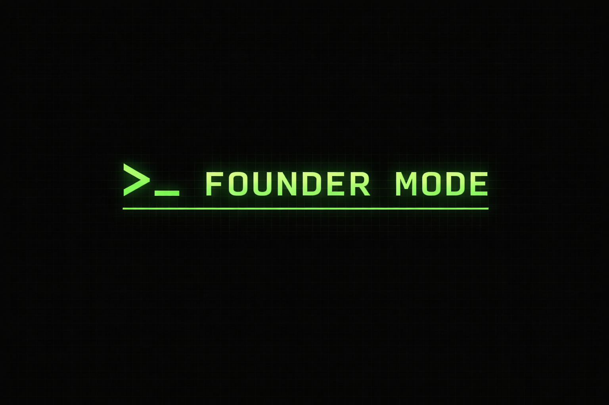

  

 Logo generated by ChatGPT 

---

My personal framework and workflow for agentic coding, **HEAVILY INSPIRED** by
[daplug](https://github.com/cruzanstx/daplug) and
[get-shit-done](https://github.com/glittercowboy/get-shit-done).

---

_Founder Mode activating soon ..._
